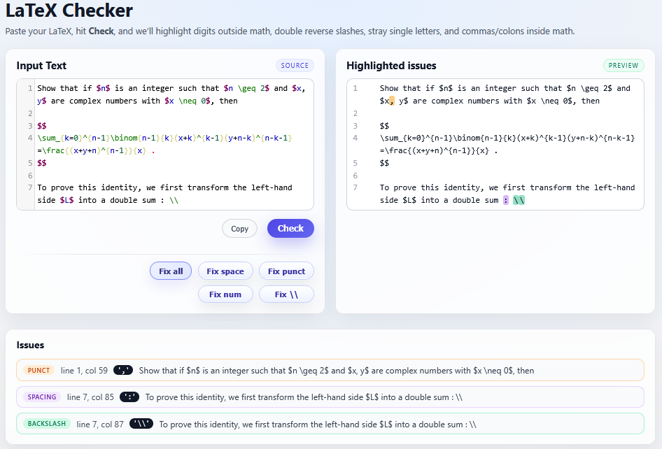
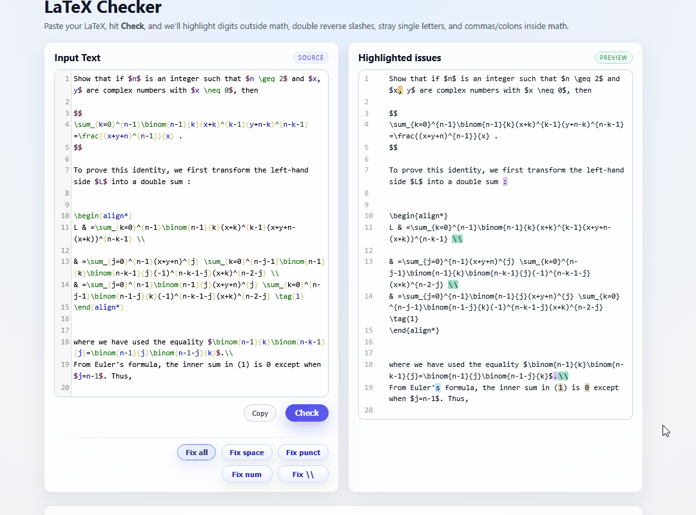
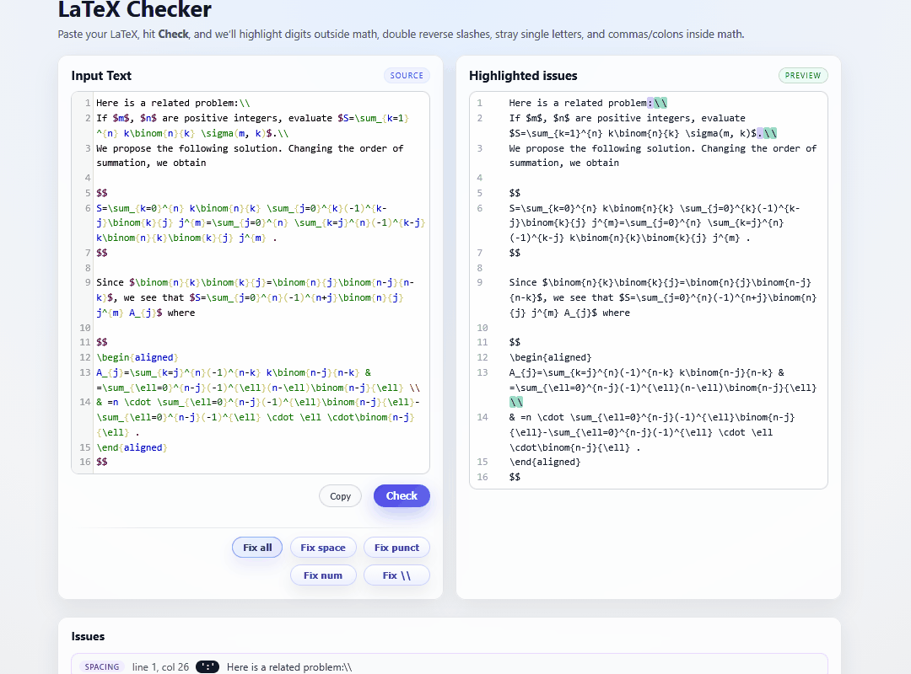
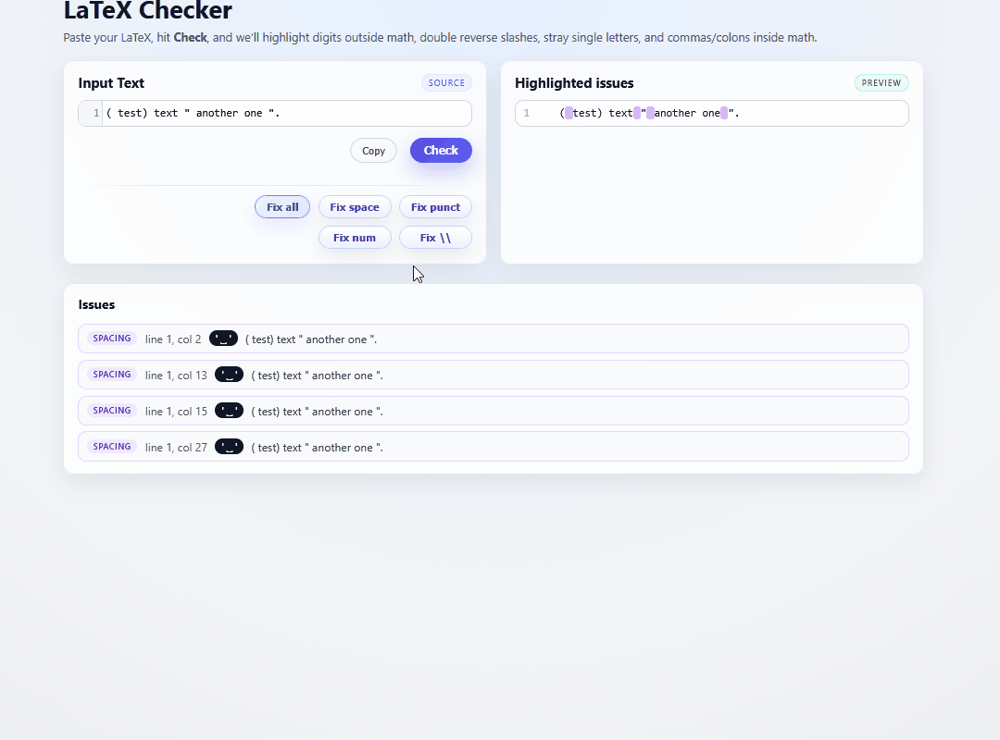
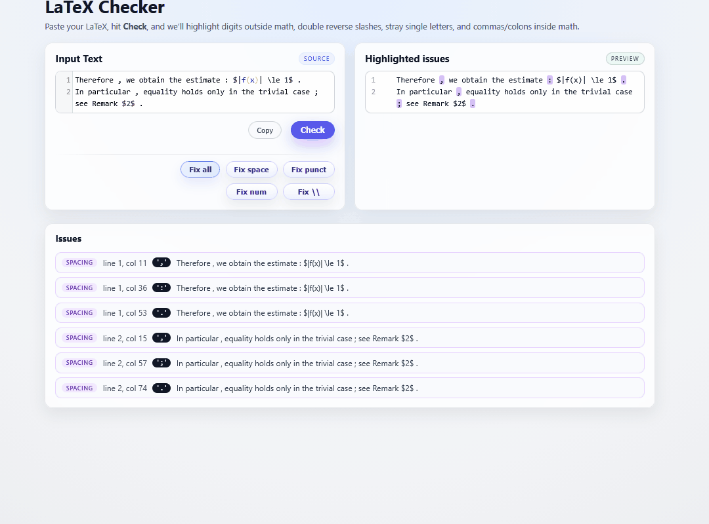
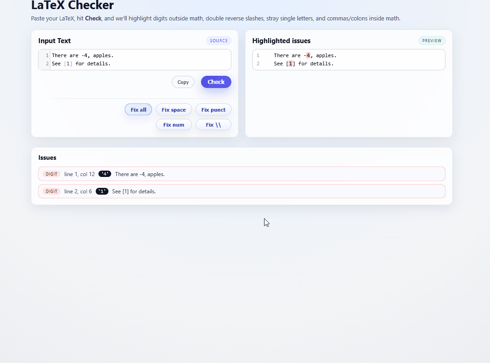

# USAGE

This app helps you **detect** and **auto-fix** common transcription/typing artifacts in LaTeX text.

> **Important:** The checker is heuristic-based (regex + simple scanning). It is not a full TeX parser. Expect occasional false positives/negatives.

---

## Quick workflow

1. Paste text into the left editor.
2. Click **Check** to highlight issues and list them below.
3. Use **Fix …** buttons to apply targeted auto-corrections.
4. Re-run **Check** (most fix actions do this automatically) to confirm the result.

<!-- TODO: Add screenshot: main screen showing editor (left), highlighted preview (right), issues list (bottom) -->


---

## Buttons and what they do

### Copy
Copies the **current editor contents** to clipboard.

---

### Check
Runs the analysis and updates:
- the **highlighted preview** (right panel)
- the **issues list** (below)

Check does **not** modify your input text.


---

### Fix all
Applies all safe fixes in a fixed order, then re-checks.

**Order (current):**
1. **Fix \\**
2. **Fix space**
3. **Fix punct**
4. **Fix num**

This order matters (e.g., punctuation fixes are cleaner after spacing fixes).

<!-- TODO: Add GIF: one-click Fix all transforming a messy sentence -->


---

### Fix \\  (double backslash)
Handles LaTeX line breaks `\\` differently depending on **math mode**.

**Rules**
- **Outside math:** `\\` becomes a **real newline** (`\n`).
  - If a newline already follows `\\`, the slashes are removed without adding an extra blank line.
- **Inside math:** `\\` is replaced with `\cr `.

**Example**
Input:
```tex
Outside one.\\ Next line.
Now math: $a\\b$.
````

Output after **Fix \\**:

```tex
Outside one.
 Next line.
Now math: $a\cr b$.
```

<!-- TODO: Add screenshot/GIF: Fix \\ applied to mixed math/non-math text -->




---

### Fix space

Removes **spaces/tabs just inside** delimiters **outside math**.

**What it targets**

* Parentheses/brackets:

  * `( test)` → `(test)`
  * `(test )` → `(test)`
* Quotes:

  * `" another "` → `"another"`
  * Works with curly quotes too (e.g., `“ like this ”` → `“like this”`)

***Note***
*As of this version the space right before the first occurence is highlighted to observe the behavior of the function.*

**Example**
Input:

```tex
( test) text " another one ".
```

Output:

```tex
(test) text "another one".
```

<!-- TODO: Add screenshot/GIF: Fix space on a typical transcription artifact -->



**Non-goals**

* It does not “reflow” spaces outside delimiters.
* It does not touch anything inside math mode.

---

### Fix punct

Removes **spaces/tabs immediately before punctuation** outside math.

**Punctuation handled**
`. , ; : ! ?`

**Example**
Input:

```tex
"there were 4 , apples ."
```

Output:

```tex
"there were 4, apples."
```

<!-- TODO: Add screenshot/GIF: Fix punct on multiple punctuation marks -->



**Non-goals**

* It does **not** add missing spaces *after* punctuation (even though the checker can flag missing-space-after as an issue).

---

### Fix num

Wraps number tokens **outside math mode** in `$...$`.

**What counts as a “number token”**

* Integers: `4`
* Signed integers: `-1`, `+2`  → wrapped as `$-1$`, `$+2$`
* Decimal/grouped: `3.14`, `1,000`, `1,000,000`

**Conservative safety rules**

* Avoids wrapping digits embedded inside words/commands.

**Example**
Input:

```tex
"there were -4 , apples ."
```

After **Fix punct** + **Fix num** (or **Fix all**):

```tex
"there were $-4$, apples."
```

<!-- TODO: Add screenshot/GIF: Fix num wrapping signed and grouped numbers -->



---

## What gets flagged on Check (issue types)

The issues list uses these kinds (names may appear as badges/tooltips):

### `digit` — digits outside math

Any digit `0–9` outside math mode is flagged.

Example:

```tex
There are 4 apples.
```

The `4` is flagged (`digit`) because it is outside `$...$`.

---

### `letter` — stray single letters outside math

Single-letter tokens (excluding `A`, `I`, and some others) outside math can be flagged.
This is meant to catch things like:

```tex
Let x be a variable.
```

(where `x` should likely be `$x$`)

> This is heuristic and language-dependent.

---

### `punct` — commas/colons inside math (unprotected)

Commas/colons inside math mode are flagged **unless** they appear inside one of these protected groupings:

* `\{ ... \}`
* `( ... )`
* `[ ... ]`

Examples:

```tex
$a,b$        % comma flagged (punct)
$(a,b)$      % comma NOT flagged (protected by parentheses)
$\{a,b\}$    % comma NOT flagged (protected by \{ \})
```

---

### `backslash` — `\\` occurrences

Any `\\` token is flagged so you can decide whether to fix it.

---

### `spacing` — spacing around punctuation or inside delimiters

This includes:

* space **before** punctuation, e.g. `word ,`
* missing space **after** punctuation, e.g. `word,next`
* space just inside quotes/parentheses, e.g. `( test )`, `" hello "`

---

## Math mode detection (important for all fixes)

The checker treats these as math regions:

* `$$ ... $$`
* `\[ ... \]`
* `\( ... \)`
* environments: `array`, `align`, `align*`, `gather`, `gather*`, `equation`
* inline `$ ... $` (single dollars)

> Nested or malformed math delimiters can confuse detection.

---